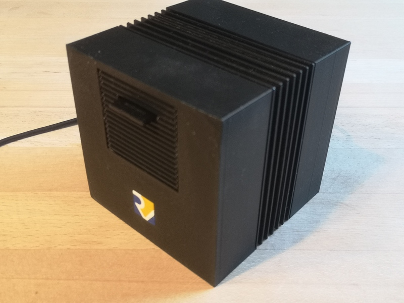
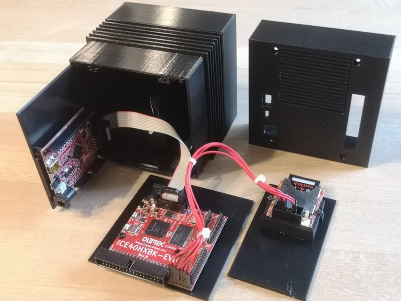

# xv6-riscv-fpga

Build a RISC-V computer system on fpga iCE40HX8K-EVB and run UNIX xv6 using only FOSS (free and open source hard- and software).



xv6-riscv is a simple educational UNIX operating system written in ANSI-C developed and used at MIT in courses to teach operating systems. The original code is implemented for RISC-V 64 bit CPU.

In this project we will build a minimal computer system based on an fpga board capable of running UNIX xv6. We will implement only the smaller 32 bit version of RISC-V CPU and we will drop all features not explicit needed to run xv6, like floating point operation and even multiplication in hardware. The remaining core is called rv32ia_zicsr and implements only a minimal command set:

- I: Integer and logic computation

- A: atomic commands

- zicsr: control register

- privileged modes (M/S/U): machine mode, supervisor mode and user mode

- virtual memory mapping

Although our CPU does not implement multiplication and floating point operation in hardware, we will see, that all this can be done in software by linking the appropriate gcc librarys. The final computer will be able to boot UNIX xv6 and even run a homemade LISP interpreter, which is cabable of doing numerical computations even on floating point numbers.

## 01_hardware

The hardware consists of three little boards available at Olimex Ltd.

* iCE40HX8K-EVB: This development board contains the fpga chip iCE40HX8K plus a 512k Byte memory chip used as RAM.

* Olimexino 32u4: This arduino like board is used
  
  1. as programmer, to upload the fpga bitstream file to the iCE40HX8K-EVB board.
  
  2. as UART bridge, to connect a terminal to the RISCV-V CPU running UNIX xv6.

* SD-CARD: This little board holds an SD-Card containing the complete file system of UNIX xv6.

Connect the three boards according to the following schematic:

## 02_software

### 02.1_oss-cad-suite

The fpga iCE40HX8K has the nice property, that it can be programmed with FOSS free and open source software. This can be done with the toolchain project icestorm provided by Clifford Wold. The complete toolchain (yosys, icestorm, place and route, programmer) is available as bundle at [GitHub - YosysHQ/oss-cad-suite-build: Multi-platform nightly builds of open source digital design and verification tools](https://github.com/YosysHQ/oss-cad-suite-build/).

- Install oss-cad-suite 02_gcc-toolchain

### 02.1_gcc-toolchain for RISC-V

The toolchain with c-compiler can be downloaded from the following site. In order to be able to build code for the rv32ia_zicsr version we need a toolchain with multilib and gcc-libary implementation for rv32i.

Attention: Download rv64imc with multilib rv32i !

[GitHub - stnolting/riscv-gcc-prebuilt: 📦 Prebuilt RISC-V GCC toolchains for x64 Linux.](https://github.com/stnolting/riscv-gcc-prebuilt)

## 03_build

### 03.1_compile bootloader

* Build the firmware, which implements a bootloader, that reads the SD-CARD. The bootloader than seaches for an ELF file containing the kernel xv6. Loads the kernel into memory and starts the kernel. 

```
$ cd fpga/boot
$ make
```

### 03.2_synthesize and upload to fpga iCE40HX8K-EVB

The fpga iCE40HX8K contains the whole hardware of our computer system:

* CPU: RV32ia_zicsr

* BOOT: Memory preloaded with bootloader

* UART: Connects the terminal to xv6 shell

* SPI: Connects the SD-Card containing the file system

To build the fpga hardware connect your computer with the programmer Olimexino 32u4 and run:

```
$ cd fpga
 make
```

### 03.3_compile xv6-riscv

* Build the software, composed of kernel and user programms and write everything on the file system. 

```
$ cd xv6-riscv
 make
$ make fs.img
```

* Write the image `fs.img` on a SD-Card.

## 04_Run

### 04_1_run xv6

Now connect to RV32ia_zicsr with USB and start a terminal session (i.e. tio). Start RV32ia_zicsr and see the welcome message. Insert the SD-Card into the reader and see if RV32 can boot UNIX xv6 from the file system.

```
$ tio -m INLCRNL /dev/ttyACM0

 ___ ___ ___  ___  __   __
| _ \_ _/ __|/ __|_\ \ / /
|   /| |\__ \ (_|___\ V / 
|_|_\___|___/\___|   \_/  

Processor: rv32ia @32MHz V1.2

0x00000000 BOOT (12 KB)
0x02000000 CLINT
0x0C000000 PLIC
0x10000000 UART
0x20000000 SD-CARD
0x80000000 RAM (512 KB)

reading superblock
sb.magic: 0x10203040
reading inode 2
reading ELF header
elf.magic: 0x464c457f
jump to entry point 0x80000000

Welcome to rv32ia 6th Edition UNIX

xv6 kernel is booting

init: starting sh
$ 
```

### 04.2_unix commands

Now that you have access to the shell you can launch UNIX commands.

```
$ ls
.              1 1 1296
..             1 1 1296
xv6.kernel     2 2 45676
README         2 3 1982
let            2 4 102
sqrt           2 5 443
sqrt2          2 6 467
fib            2 7 429
cat            2 8 4016
echo           2 9 3708
forktest       2 10 2128
grind          2 11 7952
grep           2 12 4612
init           2 13 3988
kill           2 14 3672
ln             2 15 3704
ls             2 16 4536
mkdir          2 17 3740
rm             2 18 3736
sh             2 19 7936
wc             2 20 4176
zombie         2 21 3592
stressfs       2 22 3896
uptime         2 23 3820
usertests      2 24 40660
lisp           2 25 23432
hello          2 26 3640
mem            2 27 4184
console        3 28 0
$ cat README
xv6 is a re-implementation of Dennis Ritchie's and Ken Thompson's Unix
Version 6 (v6).  xv6 loosely follows the structure and style of v6,
but is implemented for a modern RISC-V multiprocessor using ANSI C.

ACKNOWLEDGMENTS

xv6 is inspired by John Lions's Commentary on UNIX 6th Edition (Peer
to Peer Communications; ISBN: 1-57398-013-7; 1st edition (June 14,
2000)). See also https://pdos.csail.mit.edu/6.828/, which
provides pointers to on-line resources for v6.

The following people have made contributions: Russ Cox (context switching,
locking), Cliff Frey (MP), Xiao Yu (MP), Nickolai Zeldovich, and Austin
Clements.

We are also grateful for the bug reports and patches contributed by
Silas Boyd-Wickizer, Anton Burtsev, Dan Cross, Cody Cutler, Mike CAT,
Tej Chajed, eyalz800, Nelson Elhage, Saar Ettinger, Alice Ferrazzi,
Nathaniel Filardo, Peter Froehlich, Yakir Goaron,Shivam Handa, Bryan
Henry, Jim Huang, Alexander Kapshuk, Anders Kaseorg, kehao95, Wolfgang
Keller, Eddie Kohler, Austin Liew, Imbar Marinescu, Yandong Mao, Matan
Shabtay, Hitoshi Mitake, Carmi Merimovich, Mark Morrissey, mtasm, Joel
Nider, Greg Price, Ayan Shafqat, Eldar Sehayek, Yongming Shen, Cam
Tenny, tyfkda, Rafael Ubal, Warren Toomey, Stephen Tu, Pablo Ventura,
Xi Wang, Keiichi Watanabe, Nicolas Wolovick, wxdao, Grant Wu, Jindong
Zhang, Icenowy Zheng, and Zou Chang Wei.

The code in the files that constitute xv6 is
Copyright 2006-2019 Frans Kaashoek, Robert Morris, and Russ Cox.

ERROR REPORTS

Please send errors and suggestions to Frans Kaashoek and Robert Morris
(kaashoek,rtm@mit.edu). The main purpose of xv6 is as a teaching
operating system for MIT's 6.828, so we are more interested in
simplifications and clarifications than new features.

BUILDING AND RUNNING XV6

You will need a RISC-V "newlib" tool chain from
https://github.com/riscv/riscv-gnu-toolchain, and qemu compiled for
riscv64-softmmu. Once they are installed, and in your shell
search path, you can run "make qemu".
$ 
```

### 04.3_run LISP

and even run LISP on a computer system that runs UNIX on a home made CPU! 

```
$ lisp
lisp v6
sizeof pair: 2
size of number: 4
size of float: 4
size of (char*): 4
lisp> (+ 2 4)
6
lisp> 
```

## 05_cube

Finally we print case with a 3d-Printer. The case is a miniatur replica of the classic computer NeXTcube (https://en.wikipedia.org/wiki/NeXTcube). All components are mounted on trays, which can be pushed in the cube (10cm x 10cm x 10cm).

All the parts are modelled with free software tools.

- [blender](https://blender.org) is a very powerfull 3D modelling software. All parts of the cube are modelled with blender. You can edit the blender files and change details on the design. The blender-design files can than be exported to STL-format, a common 3D-file format used for 3D-printing.
- [prusa-slic3r](https://www.prusa3d.com). This is the slicer software for 3D-Printers from the manufacturer Prusa. This programm is used to convert the STL-files to printerspecific gcode-files.

The subfolder `files/` containes the blender files and the corresponging STL-files.

### 05.1_inside

The modules are mounted on trays with little screws (M3x5/M2.4x5 selfcutting). From left to right:

1. Olimexino 32u4: Programmer/UART bridge
2. iCE40HX8K-EVB: fpga development board
3. SD-Card reader
4. Thinker

# 



### 05.2_rear

On the rear cover you see connectors for power supply (5V), 34 pin GPIO and the USB connector which has dual usage:

1. upload bitstream files to iCE40 fpga
2. communicate to Hack-Computer over UART


# 

## 06_License

Copyright 2023 Michael Schröder mi.schroeder@netcologne.de

<a rel="license" href="http://creativecommons.org/licenses/by/4.0/"></a><br />Dieses Werk ist lizenziert unter einer <a rel="license" href="http://creativecommons.org/licenses/by/4.0/">Creative Commons Namensnennung 4.0 International Lizenz</a>.
